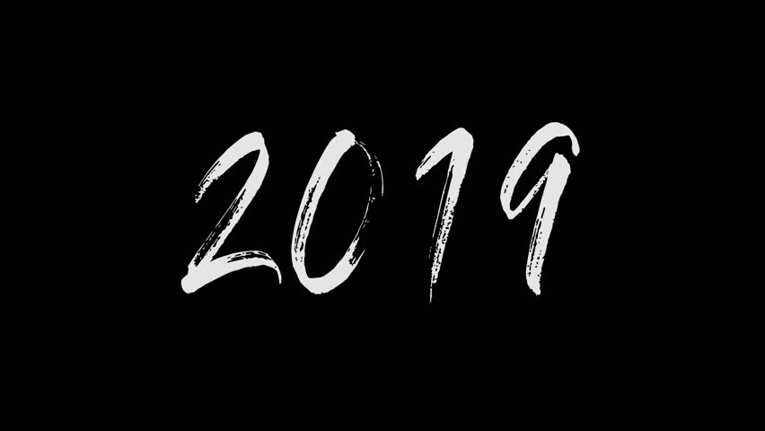
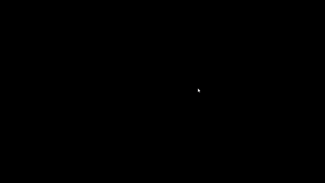

# Processing-Experiments

#### This repository contains sources for Genartive Art using Processing and its development environment.

## Bouncing Ball Abstract Art

#### The code for this art design resides in Bouncing Ball Folder.

## Gap Filling Growing Balls

#### The code for this art design resides in Growing Circles Folder.

## Image Character Art

#### The code for this art design resides in Art_2019 Folder.

##### The original image is :-

##### The Art looks like :-

