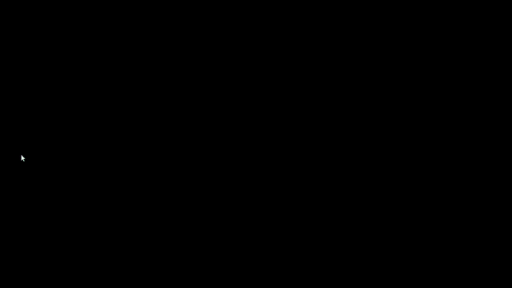

# Processing-Experiments

#### This repository contains sources for Genartive Art using Processing and its development environment.

## Bouncing Ball Abstract Art

#### The code for this art design resides in Bouncing Ball Folder.

## Gap Filling Growing Balls

#### The code for this art design resides in Growing Circles Folder.

## Image Character Art

#### The code for this art design resides in Art_2019 Folder.

##### The original image is :-

##### The Art looks like :-

## A Line Turns Eye

#### The code for this art design resides in the ALineTurnsEye.

#### Inspiration- [Link](https://www.youtube.com/watch?v=94183oE1y6U)

## Arcs

#### The code for this art design resides in Arc Folder. The arc length is controlled by the mouse position.

## Circles

#### The code for this art design resides in the Circles Folder.
#### Inspiration- [Link](https://www.youtube.com/watch?v=94183oE1y6U)

